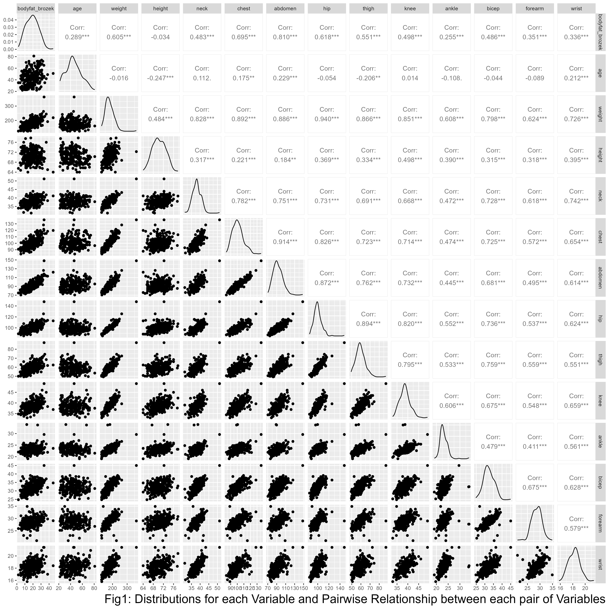

```{r echo = FALSE, message = FALSE}
#Load package and set seed
library(readxl)
library(tidyverse)
library(leaps)
library(glmnet)
library(corrplot)
library(caret)
library(MASS)
library(car)
library(GGally)
library(patchwork)

select <- dplyr::select
knitr::opts_chunk$set(echo = FALSE, message = FALSE, warning = FALSE, fig.width = 6, fig.height = 4)
set.seed(65)
```

```{r}
df_body_fat_raw <- 
  read_excel("body_density_data.xlsx") %>%
  select(-id,-bodyfat_siri,-body_density) %>%
  filter(bodyfat_brozek > 0)
#filter out high vif variable.
df_body_fat <-
  df_body_fat_raw %>%
  select(-weight,-chest,-hip,-thigh)
```
# Abstract

In this study, a multiple linear regression model is developed to predict body fat in men using scale and tape measurements. Candidate models are created using a dataset of 252 male subjects and are generated through the application of automatic procedures, criterion based procedures, and LASSO. Interactions between variables are also considered through two-way ANOVA. The final model chosen, based on its root mean square error, included age, height, neck circumference, abdomen circumference, forearm circumference, wrist circumference, and the interaction between neck and abdomen as predictors. These measurements are simple and widely available, making the model a useful tool for predicting body fat in a convenient manner.

# Introduction

Although fat is an important source of stored energy, excessive amounts of body fat have been linked to various health issues, including type 2 diabetes, heart disease, and stroke^1^. According to widely accepted standards, an adult male with more than 25% body fat and an adult female with more than 32% body fat is considered obese^2^. The National Health and Nutrition Examination Survey from 2017-2020 found that 41.9% of adults in the United States have obesity, with rates over 35% in 19 states^3^. Given the prevalence of obesity, it is important to have accurate and convenient methods for measuring body fat. However, measuring body fat can be challenging. This project aims to develop a multiple linear regression model using scale and tape measurements to predict body fat in men, using a dataset of 252 male subjects with data on body fat percentage, age, height, weight, and other body circumference measurements.

# Methods

Exploratory analysis is conducted to check for patterns, distributions, and anomalies in the dataset. This dataset contains 252 observations which are all male, and 16 variables of interest. The variables include three measures of body fat (Brozek's, Siri's, and body density) as well as age, weight, height, and various body circumference measurements including neck, chest, abdomen, hip, thigh, knee, ankle, bicep, forearm, and wrist. 
In the following analysis, percent body fat using Brozek’s equation is chosen as the outcome. Firstly, one observation with 0% body fat is removed from the dataset. The mean and range are summarized for the remaining observations^(table2)^. Then marginal distributions for each variable and pairwise relationship between each pair of variables are plotted^(fig1)^. The distributions for all variables are symmetric, so no transformation is necessary. To confirm the normality of `bodyfat_brozek`, formal Shapiro’s test is conducted, which supports the conclusion based on the histogram ^(fig2)^that the body fat percentage is normally distributed. The pairwise scatterplot shows that all variables are linearly correlated with body fat percentage. Additionally, there are many variables that are highly correlated with other variables, which warrants further investigation.

Variance inflation factor (VIF) is calculated for each variable to assess collinearity. Variables with VIF greater than 5 may have misleading coefficients due to high collinearity. Upon calculation, the variables `weight`, `hip`, `abdomen`, `chest`, and `thigh` have VIF greater than 5^(fig3a)^. However, according to the p-values of the complete linear model, only `abdomen` is significant. Therefore, all of these variables except `abdomen` are excluded. After recalculating the VIFs, no further collinearity is identified^(fig3b)^. Various model selection procedures are then applied to the remaining variables to generate candidate models, including automatic procedure (stepwise)^(table3)^, criterion based procedure^(table4)^ (Cp^(fig4a)^ value and Adjusted R square^(fig4b)^), and LASSO ($\lambda$ = 0.1)^(fig5)^^(table5)^. The interaction between main effects are also considered through a two-way ANOVA test. A 10-fold cross validation is used to compare the candidate models based on predictive ability and select a final “best” model. Diagnostic plots are also generated for comparison and final model selection.


# Result

The candidate model from stepwise regression includes `age`, `height`, `neck`, `abdomen`, `forearm`, and `wrist` as predictors to predict `bodyfat_brozek`. The candidate models from LASSO and criterion approach include the same predictors as the model from stepwise regression, but also include an additional predictor, `bicep`. Among the predictors in the candidate models, two-way ANOVA test reveals interaction between neck and abdomen has a significant p-value of 0.000477 for model 1^(table7)^ and a p-value of 0.000379 for model 2^(table8)^, indicating that it should be included in the model at a significance level of 5%. As a result, the final candidate models are as follows:

- Candidate model 1: `bodyfat_brozek` ~ `age` + `height` +  `neck` +  `abdomen` + `forearm` + `wrist` + `neck:abdomen`
 
- Candidate model 2: `bodyfat_brozek` ~ `age` + `height` +  `neck` +  `abdomen` + `forearm` + `wrist` + `bicep` + `neck:abdomen`

The root mean squared error (RMSE) for 10-fold cross validation is 3.95 for model 1 and 3.98 for model 2^(table6)^, indicating that model 1 has better predictivity than model 2. The adjusted R-squared for both models is 0.7385, which means that `bicep` does not add value to the model. Diagnosis plots also suggest that both models fit the underlying assumptions of linear regression. Based on these results, the final model chosen is candidate model 1^(table9)^.

# Discussion
Summary of the final model(Table8) for predicting body fat percentage:

Table: Model Summary

|Parameter|Coefficient|Interpretation (Holding all other variable constant)|
|:----|:----|:----|
|Intercept|-61.05|-
|
|Age|0.05|As age goes up by 1 year, the predicted body fat percentage will increase by approximately 0.05%.
|
|Height|-0.32|As height goes up by 1 inch, the predicted body fat percentage will decrease by approximately 0.32%.
|
|Neck|1.39|As neck circumference goes up by 1 cm, the predicted body fat percentage will increase by approximately 1.39%.
|
|Abdomen|1.48|As abdomen circumference goes up by 1 cm, the predicted body fat percentage will increase by approximately 1.48%.
|
|Forearm|0.28|As forearm circumference goes up by 1 cm, the predicted body fat percentage will increase by approximately 1.28%.
|
|Wrist|-1.61|As wrist circumference goes up by 1 cm, the predicted body fat percentage will decrease by approximately 1.61%.
|
|Neck:abdomen|-0.02|The effect of neck circumference on body fat percentage is slightly weaker when the abdomen circumference is also high.|

There are several limitations to the study that should be considered when interpreting these results. First, the model might not be as accurate as ideal because it only considers the interactions between two variables, as determined through an ANOVA test. This means that other potential predictor variables or interactions may have been overlooked and could potentially influence the final model. Additionally, our dataset consisted of only 252 men, which may not be representative of the larger population. As a result, the final model has limited usage and accuracy if applied to a different population of men. Another limitation of our study is the noticeable error on body fat percentage, where one man was recorded as having a body fat percentage of 0%. This raises concerns about the reliability of the other data points and could potentially impact the accuracy of the model.
Given these limitations, there are several avenues for future research that could help to improve upon the findings of our study. One possibility would be to replicate the study in a larger and more diverse sample, including both male and female subjects. Doing so could help to confirm the generalizability of our findings and identify any gender-specific differences in the predictors of body fat percentage. Additionally, future research could consider a wider range of predictor variables and interactions in order to further improve the model.

# Reference

1: [Body fat. The Nutrition Source. (2022, August 2). Retrieved December 16, 2022, from https://www.hsph.harvard.edu/nutritionsource/healthy-weight/measuring-fat/](https://www.hsph.harvard.edu/nutritionsource/healthy-weight/measuring-fat/)

2: [Neumann, K. D. (2022, December 9). How to reduce body fat. Forbes. Retrieved December 16, 2022, from https://www.forbes.com/health/body/how-to-reduce-body-fat/#:~:text=With%20that%20said%2C%20general%20body,body%20fat%20classifies%20as%20obese.](https://www.forbes.com/health/body/how-to-reduce-body-fat/#:~:text=With%20that%20said%2C%20general%20body,body%20fat%20classifies%20as%20obese.)

3: [State of obesity 2022: Better Policies for a healthier america. tfah. (2022, September 27). Retrieved December 16, 2022, from https://www.tfah.org/report-details/state-of-obesity-2022/](https://www.tfah.org/report-details/state-of-obesity-2022/)


# Appendix


```{r}
# Code for Fig1
#df_body_fat %>%
#  select(-bodyfat_siri, -body_density) %>%
#  ggpairs() +
#  labs(caption = "Fig1: Distributions for each Variable and Pairwise Relationship between each pair of Variables") +
#  theme(plot.caption = element_text(size = 20),
#        plot.caption.position = "plot")

#("./plots/bodyfat_brozek_pairs.png", width = 14, height = 14)
```


```{r results = 'hide'}
#Shapiro test
shapiro.test(df_body_fat$bodyfat_brozek)
```

```{r}
#Histogram of distribution of bodyfat
df_body_fat_raw %>%
  ggplot(aes(x = bodyfat_brozek)) +
  geom_histogram() +
  theme_bw() +
  labs(title = "Distribution of Bodyfat Index Computed by Brozek equation",
       x = "Bodyfat Index Computed by Brozek equation",
       y = "Count",
       caption = "Fig2: Distribution of Bodyfat Index Computed by Brozek equation") -> fig2
```

```{r}
fig2
```

```{r}
#Raw VIF
mult.fit <- lm(bodyfat_brozek ~ .,data = df_body_fat_raw)

vif_values <- vif(mult.fit)
v_names <- str_to_title(names(vif_values))
vif_df <- 
  tibble(variable = v_names, vif = vif_values) %>%
  mutate(variable = fct_reorder(variable,vif))

ggplot(data = vif_df,aes(x = vif_values,y = variable)) +
  geom_bar(stat = 'identity') +
  geom_vline(xintercept = 5,colour = "red",linetype = "longdash") +
  theme_bw() +
  labs(x = "VIF Value",
       y = "Variable",
       title = "VIF Value of Predictors",
       caption = "Fig3a: VIF Value of Predictors")
```

```{r}
#VIF after deletion
mult.fit <- lm(bodyfat_brozek ~ .,data = df_body_fat)

vif_values <- vif(mult.fit)
v_names <- str_to_title(names(vif_values))
vif_df <- 
  tibble(variable = v_names, vif = vif_values) %>%
  mutate(variable = fct_reorder(variable,vif))

ggplot(data = vif_df,aes(x = vif_values,y = variable)) +
  geom_bar(stat = 'identity') +
  geom_vline(xintercept = 5,colour = "red",linetype = "longdash") +
  theme_bw() +
  labs(x = "VIF Value",
       y = "Variable",
       title = "VIF Value After Removing Highly Correlated Predictors",
       caption = "Fig3b: VIF Value After Removing Highly Correlated Predictors")
```


```{r}
#Stepwise model
stepwise.fit <- step(mult.fit, direction='both',trace = FALSE)
```


```{r}
#Criterion Figure
rs <- regsubsets(bodyfat_brozek ~ ., data = df_body_fat, nbest = 1) %>% summary()
par(mfrow = c(1,2))
plot(2:9, rs$cp, xlab="# of parameters", ylab="Cp Statistic")
title("Fig4a Cp Vs. Model Size")
abline(0,1)
plot(2:9, rs$adjr2, xlab="# of parameters", ylab="Adj R2")
title("Fig4b Adj R2 Vs. Model Size")
```

```{r}
lambda_seq <- 10^seq(-3, 0, by = .1)
cv_object <- cv.glmnet(as.matrix(df_body_fat[c(-1)]), df_body_fat$bodyfat_brozek,
lambda = lambda_seq, nfolds = 5) 
#cv_object would print out opitmal lambda wiht minimal mean CV error.
```

```{r}
#Lambda Figure
highlight_lamda <- 
  tibble(lambda = cv_object$lambda,
mean_cv_error = cv_object$cvm) %>%
  arrange(mean_cv_error)


tibble(lambda = cv_object$lambda,
mean_cv_error = cv_object$cvm) %>%
  ggplot(aes(x = lambda, y = mean_cv_error)) +
    geom_point() + 
    geom_point(data = highlight_lamda[1,], aes(x = lambda, y = mean_cv_error, color = 'red')) +
    labs(x = "Lambda",
         y = "Mean CV Error",
         title = "Lambda vs. Mean CV Error",
         caption = "Fig5: Plot for Selecting the Optimal Lambda") +
    theme_bw() -> fig5
fig5 + theme(legend.position = "none")
```

```{r}
#Lasso fit object
lasso_fit <- glmnet(as.matrix(df_body_fat[c(-1)]), df_body_fat$bodyfat_brozek, lambda = cv_object$lambda.min)
```

```{r}
final_mod1 <- update(stepwise.fit, . ~ . + neck*abdomen)
```

```{r}
#Diagnostic Plot of Final Model
par(mfrow = c(2,2))
plot(final_mod1)
text(x = 1, y = 1, "Total", cex = 1.5, col = "red")
```

```{r}
#Descriptive Statistics table
df_body_fat %>%
  gtsummary::tbl_summary() %>%
  gtsummary::as_kable(format = "latex", caption = "Descriptive Statistics")
```

```{r}
#Stepwise model table
summary(stepwise.fit) %>% 
  broom::tidy() %>% 
  rename(Term = term,
         Estimate = estimate,
         `Standard Error` = std.error,
         `Test Statisitcs` = statistic,
         `P-value` = p.value) %>%
  knitr::kable(digits = c(5,2,2,2), "latex",caption = "Model Parameter for Stepwise Procedure")
```

```{r}
#Table for Cp and adjr2 value
criterion_mat <- as.matrix(df_body_fat)
cp <- leaps(x = criterion_mat[,c(-1)] , y = criterion_mat[,1], nbest = 1, method = "Cp")$Cp
adjr2 <- leaps(x = criterion_mat[,c(-1)] , y = criterion_mat[,1], nbest = 1, method = "adjr2")$adjr2
tibble(`Number of Parameter` = c(2:10),`Cp Value` = cp, `Adjusted R Square` = adjr2) %>%
  knitr::kable(digits = c(0,2,3),"latex",caption = "Criterion Score For Different Model Sizes")
```

```{r}
#LASSO model table
lasso_fit %>% broom::tidy() %>%
  select(term,estimate) %>%
  rename(Term = term,
         Esitmate = estimate) %>%
  knitr::kable(digits = 3, "latex",caption = "Model Parameter for Lasso Fit")
```

```{r}
#Validation for Candidate model 1 and 2
train = trainControl(method = "cv", number = 10)
model2_caret <- train(bodyfat_brozek ~ age + height + neck + abdomen + 
    forearm + bicep + wrist + neck:abdomen, data = df_body_fat,
trControl = train,
method = 'lm',
na.action = na.pass)
mod2 <- model2_caret$results[c(2,3,4)] %>% as_tibble()


train = trainControl(method = "cv", number = 10)
model1_caret = train(bodyfat_brozek ~ age + height + neck + abdomen + 
    forearm + wrist + neck:abdomen, data = df_body_fat,
trControl = train,
method = 'lm',
na.action = na.pass)
mod1 <- model1_caret$results[c(2,3,4)] %>% as_tibble()

bind_rows(mod1,mod2) %>%
  add_column(Model = c(1,2)) %>%
  select(Model,everything()) %>%
  rename(`R-square` = Rsquared) %>%
  knitr::kable(digits = 2, "latex",caption = "Validation Results for Candidate models")
```

```{r}
#Table of Two-way ANOVA Test for Model Candidate 1
aov(update(stepwise.fit, . ~ . + bicep + neck*abdomen)) %>%
  broom::tidy() %>%
  filter(term != "Residuals") %>%
  select(-df) %>%
  rename(Term = term,
         `P-value` = p.value,
         SSE = sumsq,
         MSE = meansq,
         `F-stats` = statistic) %>%
  dplyr::mutate_if(is.numeric, funs(as.character(signif(., 3)))) %>%
  knitr::kable(digits = 2, "latex",caption = "Two-way ANOVA Test for Model Candidate 1")
```

```{r}
#Table of Two-way ANOVA Test for Model Candidate 2
aov(update(stepwise.fit, . ~ . + neck*abdomen)) %>%
  broom::tidy() %>%
  filter(term != "Residuals") %>%
  select(-df) %>%
  rename(Term = term,
         `P-value` = p.value,
         SSE = sumsq,
         MSE = meansq,
         `F-stats` = statistic) %>%
  dplyr::mutate_if(is.numeric, funs(as.character(signif(., 3)))) %>%
  knitr::kable(digits = 2, "latex",caption = "Two-way ANOVA Test for Model Candidate 2")
```

```{r}
#Final Model Parameter
summary(final_mod1) %>%
  broom::tidy() %>% 
  rename(Term = term,
         Estimate = estimate,
         `Standard Error` = std.error,
         `Test Statisitcs` = statistic,
         `P-value` = p.value) %>%
  dplyr::mutate_if(is.numeric, funs(as.character(signif(., 3)))) %>%
  knitr::kable(digits = 2, "latex",caption = "Final Model Parameter")
```

